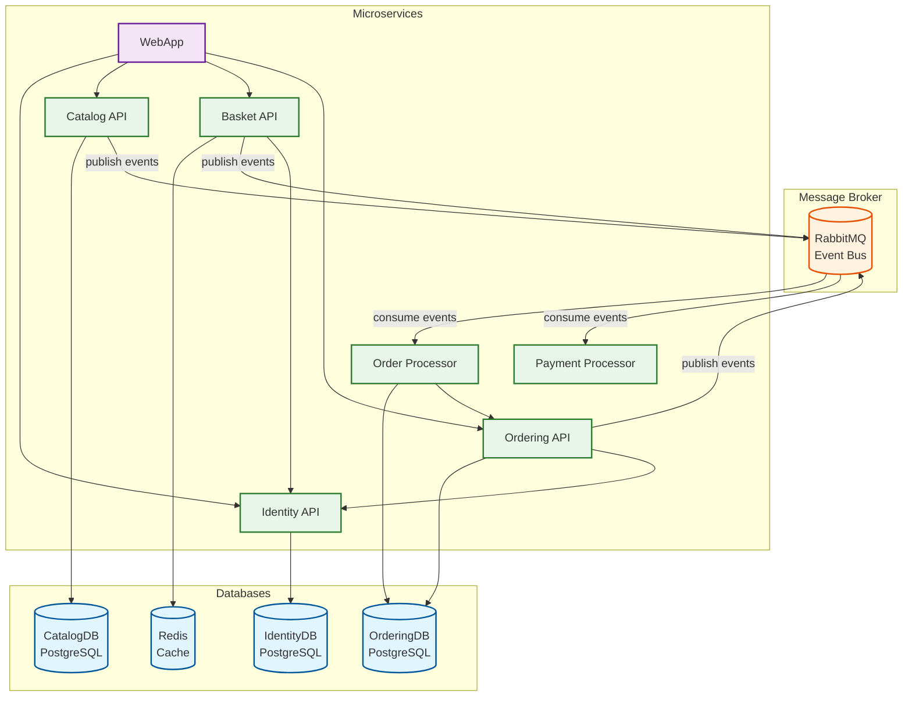

# Automated-E-Commerce-Deployment-Platform

## Archticture 



## Build And Run 
### 1. create `.env` file 
`.env` example
```
postgres_password=your_password
rabbitmq_password=your_password
```

### 2. run the project in docker
```bash
docker compose --env-file .env up -d 
```