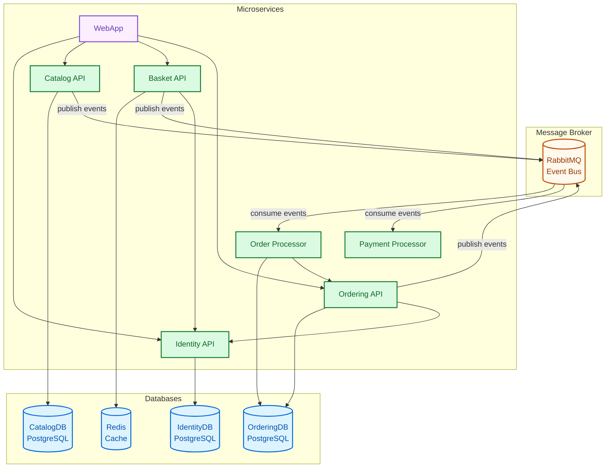

# Automated-E-Commerce-Deployment-Platform

## Archticture 



## Build And Run 
### Run With Shell Variables
#### 1. export required varaiables
```bash
export postgres_password=your_password 
export rabbitmq_password=your_password
```

#### 2. run with docker compose
```bash
docker compose up -d
```

### Or Use `.env` File
#### 1. create `.env` file 
`.env` example
```
postgres_password=your_password
rabbitmq_password=your_password
```

#### 2. run the project in docker
```bash
docker compose --env-file .env up -d 
```